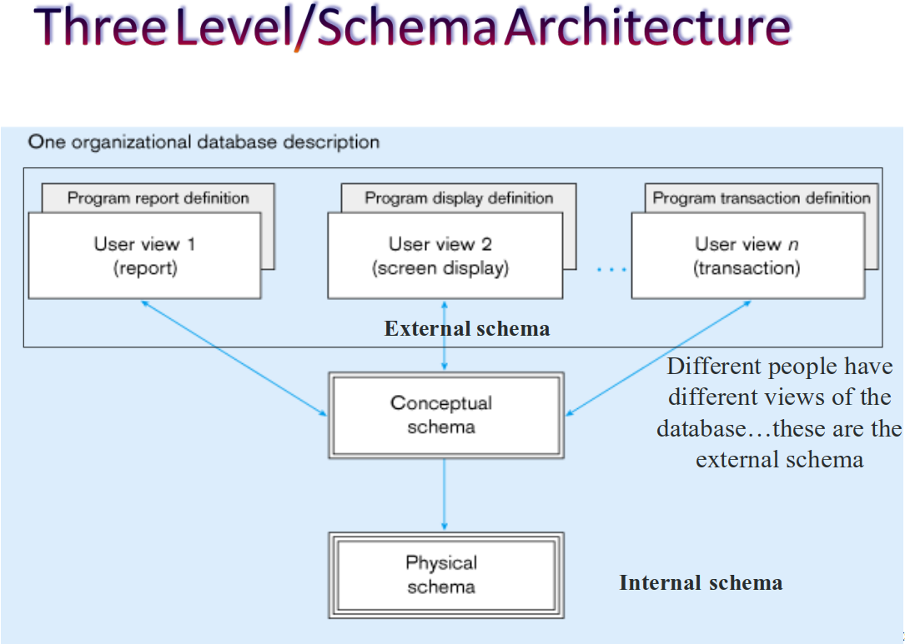

****
## 1-Introduction
- **Database Management System (DBMS)** is software that provides tools and processes to store, manage, and interact with data in a database. It acts as an **interface** between users and the database, allowing them to efficiently organize, retrieve, update, and manipulate data.
- ##### Types of Data:
	- **Structured Data**
		- Organized data that follows a fixed schema (`e.g`, tables in a database).
		- Easily stored and processed (`e.g`, Excel files, SQL databases).
	- **Unstructured Data**
		- Data that does not follow a predefined format or structure.
		- `e.g` text, images, videos, social media content, emails, etc.
	- **Semi-Structured Data**
		- Contains elements of both structured and unstructured data.
		- Does not follow a rigid structure but has some organizational properties (`e.g`, XML, JSON files).
		-  [Difference between XML and JSON](https://www.geeksforgeeks.org/difference-between-json-and-xml/)
***
### 2-File-Based vs DBMS
- **What is a File-Based System?**
	- In a file-based system, data is stored in separate files, and each application manages its own data. This leads to problems like:
		- **Data Redundancy**: The same data is stored in multiple places, leading to inconsistencies.
		- **Program-Data Dependence**: Applications are tightly coupled to the data format, making it hard to change the data structure.
		- **Limited Data Sharing**: Data is isolated, making it difficult for different applications to share data.
- **What is DBMS?**
	- A **Database Management System (DBMS)** is software that helps manage databases. It solves many of the problems of file-based systems by:
		- **Centralizing Data**: Data is stored in one place, reducing redundancy.
	    - **Providing Data Independence**: Applications don’t need to worry about how data is stored.
	    - **Enforcing Data Integrity**: Rules (constraints) ensure data is accurate and consistent.
	    - **Supporting Data Sharing**: Multiple users can access the same data simultaneously.
	    - **Data Abstraction:** Hides the complexity of data storage from users, allowing them to interact with the data using high-level queries.
	- **Key Advantages of DBMS**:
		- **Standardization**: SQL is used to query and manage data.
		- **Backup and Recovery**: Easier to recover data in case of failure.
		- **Security**: Access controls ensure only authorized users can access data.
***
### 3-Database Concepts
- **What is a Database?**
	- A **database** is a collection of related data. `e.g` a company’s database might store information about employees, products, and customers.
- **What is a DBMS(Database Management System)?**
	- A **DBMS** is software that helps create, manage, and query databases. `e.g` include MySQL, Oracle, and PostgreSQL.
- **What is a Database System?**
	- A **database system** includes the DBMS, the data, and the applications that use the data.
- **Roles in Database Management**:
	- **Database Administrator (DBA)**: Manages the database system, ensures security, and performs backups.
	- **Database Designer**: Designs the database structure (`e.g`, tables, relationships).
	- **Application Programmers**: Write code to interact with the database.
	- **End Users**: Use the database through applications (`e.g`, entering data, generating reports).
***
### 4-Data Models
- **What is a Data Model?**
	- A *data model* is a way to represent the structure of a database. There are three levels:
		- **External Schema**: What the user sees (`e.g`, a report or a form).
		- **Conceptual(Logical) Schema**: The logical design of the database (`e.g`, tables, relationships).
		- **Internal(Physical) Schema**: How the data is physically stored (`e.g`, files, indexes).
  
		

***
### 5-Entity-Relation Diagram (ERD)
- **What is an ERD?**
	- An **ERD** is a visual representation of the database structure. It shows:
		- **Entities**: Objects or concepts (`e.g`, Customer, Product).
		- **Attributes**: Properties of entities (`e.g`, Customer Name, Product Price).
		- **Relationships**: How entities are connected (`e.g`, a Customer places an Order).
- **ERD Notations:**
	- **Rectangles**: Represent entities (`e.g`, Customer, Order).
	- **Diamonds**: Represent relationships (`e.g`, "*places*" between Customer and Order).
	- **Ellipses**: Represent attributes (`e.g`, Customer Name, Order Date).
- **Types of Entities**:
	- **Strong Entity**: Has a primary key (`e.g`, Customer ID).
	- **Weak Entity**: Depends on another entity for its identity (`e.g`, an Order Line depends on an Order).
- **Types of Attributes**:
	- **Simple Attribute**: A single value (`e.g`, Age).
	- **Composite Attribute**: Made up of multiple parts (`e.g`,*Address = Street + City + Zip*).
	- **Multi-valued Attribute**: Can have multiple values (`e.g`, Phone Numbers).
	- **Derived Attribute**: Calculated from other attributes (`e.g`, Age derived from Date of Birth).
***
### 6-Relationships
- **What is a Relationship?**
	- A *relationship* *connects* *entities*. `e.g`, a Customer "*places*" an Order.
	- *Relationships* can have attributes (`e.g`, the date an order was placed).
- **Degree of Relationships**:
	- **Unary**: A *relationship* within the *same entity* (`e.g`, an Employee manages another Employee).
	- **Binary**: A *relationship* between *two entities* (`e.g`, Customer places Order).
	- **Ternary**: A `relationship` among `three entities` (`e.g`, Student, Course, and Instructor).
- **Cardinality**:
	- **One-to-One**: *One entity* is *related* to *one other entity* (`e.g`, one Employee has one Office).
	- **One-to-Many**: *One entity* is *related* to *many others* (`e.g`, one Customer places many Orders).
	- **Many-to-Many**: *Many entities* are *related* to *many others* (`e.g`, many Students take many Courses).
- **Participation Constraint**:
	- **Total Participation**: *Every entity must participate* in the *relationship* (`e.g`, every Order must have a Customer).
	- **Partial Participation**: *Some entities may not participate* (`e.g`, not every Employee manages a Department)
***
### 7-Keys
- **What is a Key?**
	- A *key* is an attribute (or set of attributes) that uniquely identifies an entity.
	- **Types of Keys**:
		- **Candidate Key**: A set of attributes that can uniquely identify an entity (`e.g`, SSN or Email for a Customer).
		- **Primary Key**: The chosen candidate key for unique identification.
		- **Foreign Key**: Links two tables (`e.g`, Order table has a Customer ID to link to the Customer table).
		- **Composite Key**: A key made up of multiple attributes (`e.g`, First Name + Last Name).
***
### 8-Mapping
1. **Basic Database Concepts**
	- **Table (Entity)**: A collection of records (`e.g`, a "*Customer*" table)
	- **Attribute (Column/Field)**: A characteristic of an entity (`e.g`, "*Customer Name*").
	- **Row (Record/Tuple)**: A single instance of an entity (`e.g`, one customer’s details).
	- **Database**: A collection of related tables.
2. **Steps for Mapping ERD to Database tables:**
	1. **Mapping Regular Entity Types**
		- Create a table for each entity.
		- Choose a primary key (`e.g`, Customer ID).
		- `Example:` A "*Customer*" table with attributes like Name, Address, etc.
	2. **Mapping Weak Entity Types**
		- Weak entities depend on another entity (`e.g`, an "*Order Line*" depends on an "*Order*").
		- Add a foreign key to link to the owner entity.
		- `Primary key = Partial key of weak entity + Primary key of owner entity`.
	3. **Mapping Binary $1:1$ Relationships**
		- If both sides are mandatory, merge the tables.
		- If one side is optional, add a foreign key to the optional side.
		- `Example:` An "*Employee*" has a "*Computer*" ($1:1$  relationship).
	4. **Mapping Binary $1:N$ Relationships**
		- Add a foreign key to the $N$ side (many side).
		- `Example:` An "*Employee*" works in a "*Department*" (*1:N* relationship).
	5. **Mapping Binary $M:N$ Relationships**
		- Create a new table with foreign keys from both entities.
		- `Example:` A "*Student*" takes a "*Course*" ($M:N$ relationship).
	6. **Mapping $N$-ary Relationships**
		- For relationships involving more than two entities, create a new table with foreign keys from all entities.
		- `Example:` A "*Supplier*" supplies a "*Part*" to a "*Project*" ($3$-way relationship).
	7. **Mapping Unary Relationships**
		- A relationship within the same entity (`e.g`, an "*Employee*" manages another "*Employee*").
		- Add a foreign key to the same table.
		- `Example:` A "*Manager ID*" column in the "*Employee*" table.
- *Notes:*
	- **Composite Attributes**: Break into simple attributes (`e.g`, "*Address*" → Street, City, Zip).
	- **Derived Attributes**: Usually not stored in the database (`e.g`, "*Age*" derived from "*Date of Birth*").
	- **Multivalued Attributes**: Create a separate table (`e.g`, "*Phone Numbers*" for a *customer*).
***
### 9-Normalization
- **What is Normalization?**
	- *Normalization* is the process of *organizing data* to *reduce redundancy* and *improve efficiency*.
	- **Normal  Forms:**
		- **1NF**: Eliminate duplicate columns and ensure atomic values.
		- **2NF**: Remove partial dependencies (`e.g`, ensure all non-key attributes depend on the entire primary key).
		- **3NF**: Remove transitive dependencies (`e.g`, ensure non-key attributes depend only on the primary key).

   - **Dependencies:**
		- It’s a relationship between columns in a database table. It occurs when the value of one column (or a set of columns) uniquely determines the value of another column within the same table.
		- **Types:**
			- **Fully Dependent:**
				- Occurs when a non-key attribute is fully dependent on the entire primary key, rather than just a part of it.
			- **Partially Dependent:**
				- Occurs when a non-key attribute is dependent on only a part of the composite primary key, rather than on the entire composite key.
			- **Transitive Dependent:**
				- Occurs when a non-key attribute depends on another non-key attribute, rather than directly on the primary key.
***
### 10-Database Management
- **Backup and Recovery**:
	- Regularly back up your database to prevent data loss. DBMS provides tools for recovery in case of failure.
- **Security**:
	- Use access controls to restrict who can view or modify data.
- **OLAP & OLTP**:
	- **OLTP (Online Transaction Processing)**: Handles real-time operations (`e.g`, processing orders).
	- **OLAP (Online Analytical Processing)**: Used for data analysis and reporting (`e.g`, generating sales reports).
***
